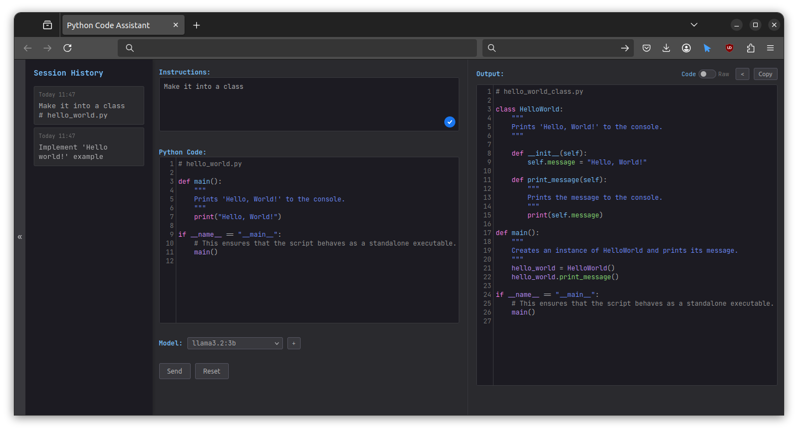

# Python Code Assistant

A web-based tool that uses AI to help you write, refactor, and optimize Python code. Leveraging the power of LLMs (Large Language Models) through Ollama, this application provides a clean, IDE-like interface for improving your Python code based on natural language instructions.



## Features

- **Instruction-Based Code Generation**: Provide natural language instructions and let the AI generate or modify code for you
- **Code Editor Interface**: Syntax highlighting and code formatting for both input and output
- **Dual Display Modes**: View output as raw code or with rich markdown formatting that includes explanations
- **Session History**: Track and revisit your previous code generation requests
- **Copy Functionality**: Easily copy generated code or explanations to clipboard
- **Model Selection**: Change and add models on the fly.
- **Responsive Design**: Clean, modern UI that works across different device sizes

## Installation

### Prerequisites

- Python 3.10+
- Ollama installed locally (for local LLM processing)
- Docker (optional, for containerized deployment)

### Setup Instructions

1. Clone the repository:
   ```bash
   git clone https://github.com/barwojcik/code_assistant.git
   cd code_assistant
   ```

2. Create and activate a virtual environment:
   ```bash
   python -m virtualenv venv
   source venv/bin/activate  # On Windows, use: venv\Scripts\activate
   ```

3. Install the required dependencies:
   ```bash
   pip install -r requirements.txt
   ```

4. Configure the application:
   - Update the settings in `config.py` to match your needs
   - Make sure Ollama is running with your preferred LLM model

5. Start the application:
   ```bash
   python app/app.py
   ```

6. Open your browser and navigate to (default config):
   ```
   http://localhost:5000
   ```
### Docker Setup Instructions

1. Clone the repository:
   ```bash
   git clone https://github.com/barwojcik/code_assistant.git
   cd code_assistant
   ```

2. Configure the application:
   - Update the settings in `config.py` to match your needs
   - Make sure Ollama is running with your preferred LLM model


3. Build the Docker image:
   ```bash
   docker build -t code-assistant .
   ```

4. Run the container:
   ```bash
   docker run --network host --name code-assistant code-assistant
   ```
   
5. Open your browser and navigate to (default config):
   ```
   http://localhost:5000
   ```
   
## Configuration
The configuration file `config.py` allows you to customize the application's behavior, by extending the base Flask configuration with custom keys.

### History
The `MAX_HISTORY_LENGTH` key enables you to configure the maximum number of storied entries that can be visible in the **Session History** panel.
```python
MAX_HISTORY_LENGTH = 10
```
### Ollama
The `OLLAMA` configuration key provides control over the client, custom prompt function injection, and passing additional arguments to Ollama's generate function. This enables you to fine-tune the application's behavior for optimal code generation results.
```python
OLLAMA = dict(
    ollama_model='model name',
    ollama_host='host:port',
    prompt_function=lambda instruction, code: f'prompt template ({instruction}, {code})',
    generate_kwargs=dict(
        system='system message',
    ),
)
```
   
## Usage

1. **Enter Instructions**: Type natural language instructions for what you want to do with your code (e.g., "Optimize this function for better performance", "Add proper error handling", etc.)

2. **Input Code**: Enter the Python code you want to modify or leave it blank to generate code from scratch

3. **Process Request**: Click the "Send" button to process your request

4. **View Results**: The generated code will appear in the output panel
   - Toggle between "Code" view (just the code) and "Raw" view (full explanation with markdown formatting)
   - Use the copy button to copy the output to your clipboard
   - Use the "<" button to copy the output back to the input for further refinement

5. **History**: Access your previous requests from the history panel on the left
   - Each entry shows the timestamp and a snippet of your instructions
   - Click on an entry to reload that request and its response

6. **Model Selection**: Choose between different Ollama models for code generation
   - The application automatically detects available models from your Ollama installation
   - Switch between models to optimize for different code generation tasks
   - The default model is configured in the application settings (currently llama3.2:1b)

## API Endpoints

The application provides the following API endpoints:

- `GET /`: Renders the main application interface
- `POST /api/v1/instructions`: Processes code generation requests
  - Input: JSON with `userInstruction` and `userCode` fields
  - Output: JSON with `success` status, `output` (generated code) and `raw_response` (full explanation)
- `GET /api/v1/history`: Retrieves the history of code generation requests
  - Output: JSON with `success` status and `history` array containing all recorded interactions
- `GET /api/v1/model`: Retrieves information about available models and the current model in use
  - Output: JSON with `success` status, `available_models` array and `current_model` string
- `POST /api/v1/model`: Sets the active model for code generation
  - Input: JSON with `model` field containing the model name
  - Output: JSON with `success` status
- `GET /api/v1/health`: Health check endpoint for monitoring service status
  - Output: JSON with `status`, `services` status, and version information

